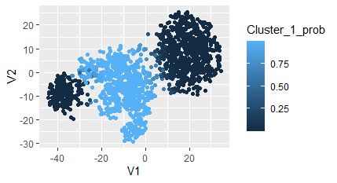

# Project 1 - *CoralSpecies*

**CoralSpecies** I cluster three species based on features. Use the Principal Components anaylsis to check for variabilty and
apply stochastic neighbor embedding to decrease dimensions.
Fianlly use Gaussian Mixture models with 3 clusters

Submitted by: **Benson Wainaina**

**Image showing the three clusters**

**Improved model**

Improved the model but changing perplxity value to ensure better clustering with a value of 45 being better than 30.
Time spent: **8** hours spent in total

